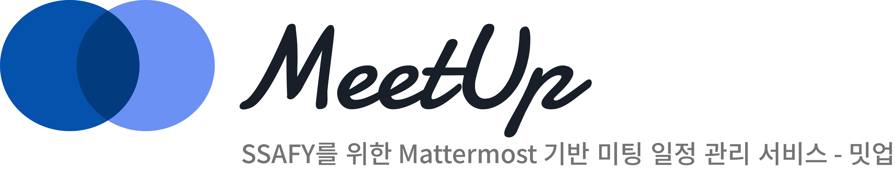

# 🔵 MeetUp

>  ## [밋업 서비스 바로가기](http://meet-up.co.kr)
>
>  SSAFY를 위한 미팅 일정 관리 서비스, **밋업**을 소개합니다!

밋업의 사용법을 알아보고 싶다면 ▶ [유저 시나리오-컨설턴트](https://meetup.gitbook.io/meetup-docs/user-scenario/consultant) |   [유저 시나리오-학생](https://meetup.gitbook.io/meetup-docs/user-scenario/student)

버그 제보나 개선사항 요구도 늘 환영이에요! ▶  [밋업-버그 리포트](https://docs.google.com/spreadsheets/d/1shZ7Fk3twrIv9QMS2wZ3ZeBicoMZxZ4CCWvJozkZWIE/edit?usp=sharing)

전체적인 후기를 남겨주시면 더 좋은 밋업에 많은 도움이 됩니다! ▶ [사용자 후기](https://docs.google.com/forms/d/1mgH_1hJLntyPuFYzc4ivK6Yx6mBxodJVEMPjuEABkUY/edit?ts=6360db33) 

# 🚀 Project & Members

> 진행기간: 2022. 10. 10. ~ 2022. 11. 18 (6주)

### 프로젝트 소개

💡 [MeetUp 노션 구경가기](https://www.notion.so/MEET-UP-6622422c3f554e6e852e7996eefeec77) | [MeetUp GitBook 구경가기](https://meetup.gitbook.io/meetup-docs/)

### 프로젝트 멤버

[박성민](https://github.com/seongminP98) | [김명석](https://github.com/audtjr9514) | [신선영](https://github.com/drsuneamer) | [연승용](https://github.com/silversalmon216) | [이규민](https://github.com/qminlee723) | [채민진](https://github.com/MinjinChae)

#  🤝 협업툴

- Git
- GitLab
- Atlassian Jira
- Notion
- Mattermost
- Webex

# ⚙️ 기술 스택

### **backend**

- IntelliJ IDE
- Java 11
- Springboot 2.7.3
- Spring Data JPA
- Spring Security
- MySQL
- Redis
- Swagger 2.9.2
- jsoup 1.15.3
- Spring Batch

### **frontend**

- Visual Studio Code IDE
- TypeScript
- React 18.2.0
- Redux-toolkit 1.8.5
- TailwindCSS

### **API**

* Mattermost API

### **CI/CD**

- Docker
- AWS EC2
- Jenkins
- NGINX
- SSL
