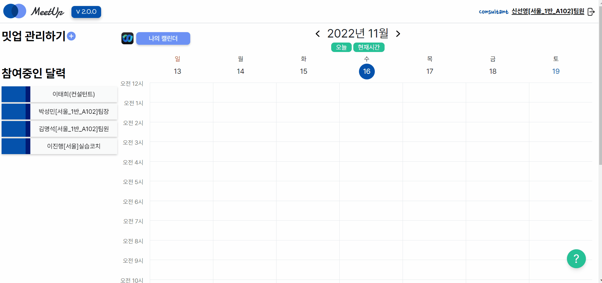
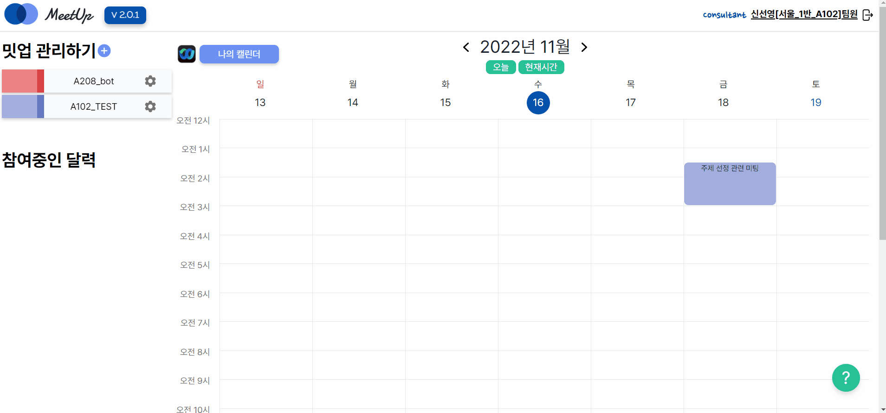
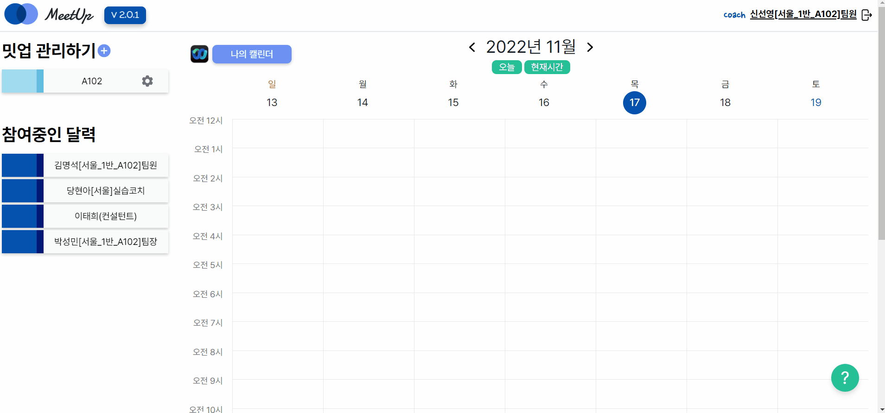
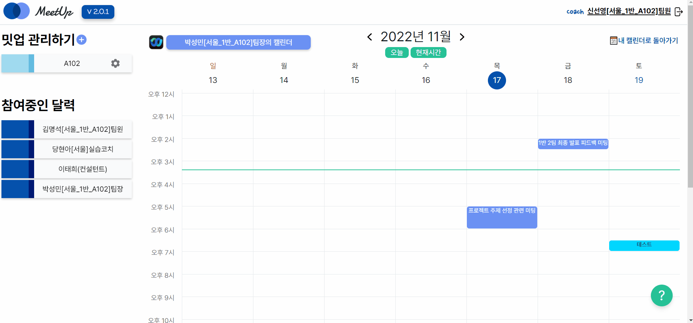
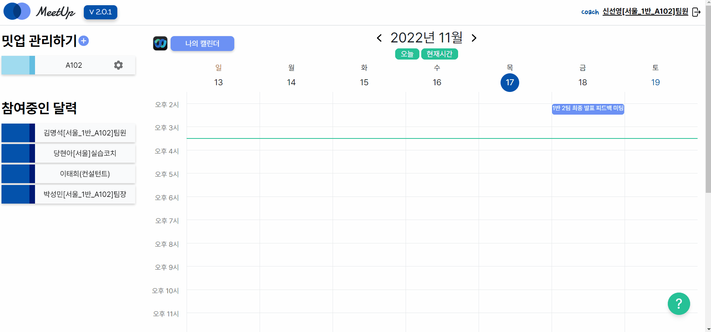
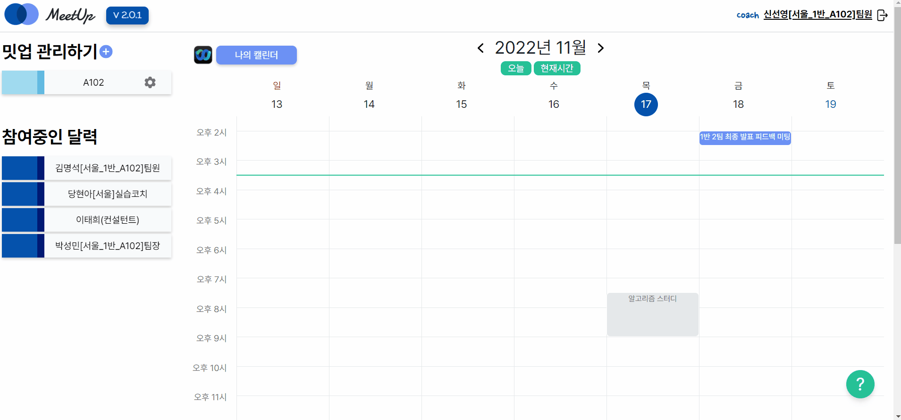
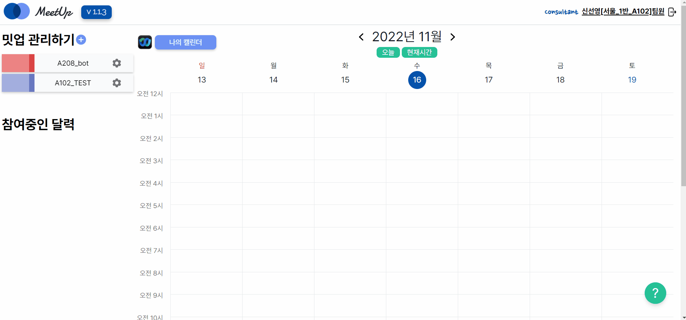
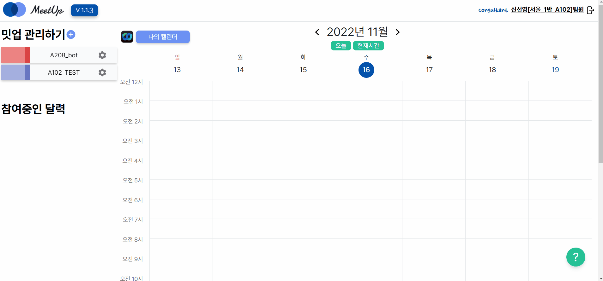
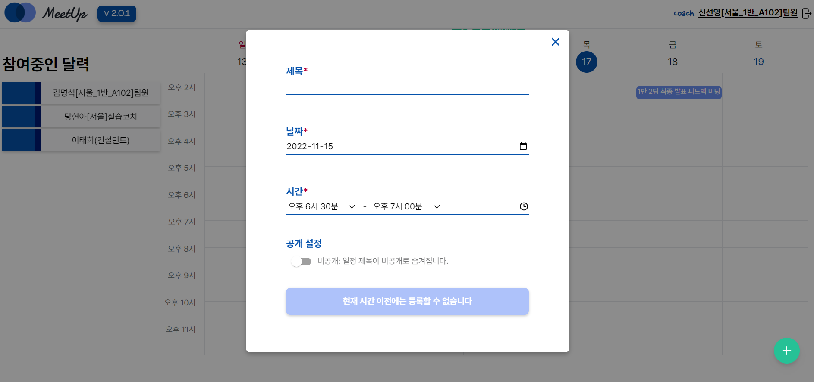
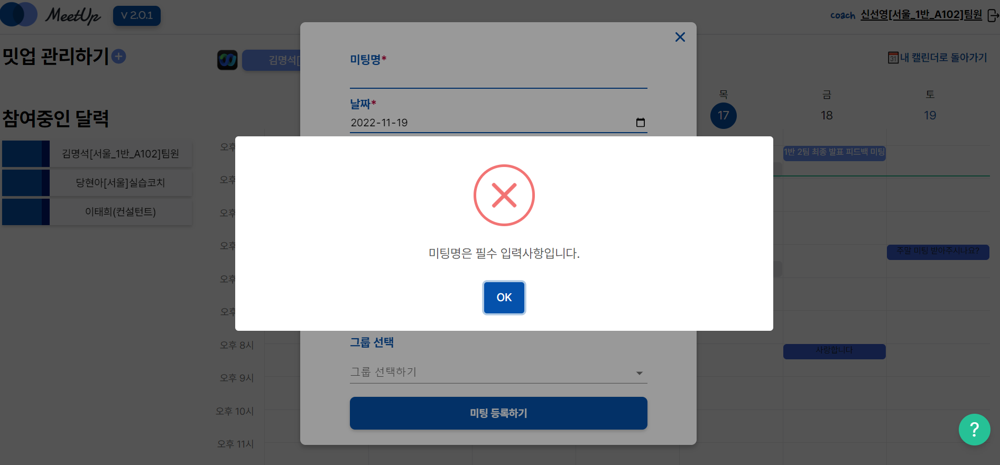

# 🔵 MeetUp

>  ## [밋업 서비스 바로가기](http://meet-up.co.kr)
>
>  SSAFY를 위한 미팅 일정 관리 서비스, **밋업**을 소개합니다!

# 🚀 Project & Members

> 진행기간: 2022. 10. 10. ~ 2022. 11. 18 (6주)

### 프로젝트 소개

싸피의 2학기, 프로젝트를 진행하다보면 하루에도 몇 번이고 마주해야 하는 컨설턴트님, 코치님들과의 미팅!

하지만 언제 시간이 되시는지 몰라 계속 다시 여쭤봐야 하거나,

일정을 정한 후에도 서로 착각하여 혼선이 생기는 일이 있으셨다구요?

**MeetUp** 과 함께라면 이제는 그럴 일이 없습니다!

내가 미팅을 신청하고 싶은 컨설턴트 님의 캘린더에서 일정을 신청하고,

등록, 수정, 삭제 알림까지 매터모스트로 한 번에!

🔗 **[MeetUp 노션 바로가기](https://www.notion.so/MEET-UP-6622422c3f554e6e852e7996eefeec77)**

🔗 **[MeetUp GitBook 바로가기](https://meetup.gitbook.io/meetup-docs/)**

🔗 [**버그 리포트 남기기**](https://docs.google.com/spreadsheets/d/1shZ7Fk3twrIv9QMS2wZ3ZeBicoMZxZ4CCWvJozkZWIE/edit?usp=sharing)

🔗 [**릴리즈 노트 바로가기**](https://meetup.gitbook.io/meetup-docs/release-notes/meetup-1.x)

🔗 **[유저 시나리오-컨설턴트](https://meetup.gitbook.io/meetup-docs/user-scenario/consultant) |  [유저 시나리오-학생](https://meetup.gitbook.io/meetup-docs/user-scenario/student)**

### 프로젝트 멤버

|                 |               |                     |
| -------------------------------------------- | ------------------------------------------ | ------------------------------------------------ |
| BE [박성민👑](https://github.com/seongminP98) | BE [김명석](https://github.com/audtjr9514) | BE  [연승용](https://github.com/silversalmon216) |
|                 |               |                     |
| FE [신선영](https://github.com/drsuneamer)   | FE [이규민](https://github.com/qminlee723) | FE [채민진](https://github.com/MinjinChae)       |

#  🤝 협업툴

     

# ⚙️ 기술 스택

### **backend**

          

### frontend

    

### **API**

  

### **CI/CD**

    

# 🐾 버전 기록

| 버전     | 업데이트 내용                                                | 업데이트 날짜 |
| -------- | ------------------------------------------------------------ | ------------- |
| `v2.0.0` | **RELEASE** 2차 릴리즈 - 채널 생성, 그룹 기능 추가           | 22.03.16.     |
| `v1.1.3` | **feat** 미팅 수정/삭제 mm 알림 추가  **changed** 이전 날짜에는 미팅 신청 불가 | 22.03.14.     |
| `v1.1.2` | **feat** 미팅 중복 신청 불가 **bugfix** 밋업 삭제 후 재생성 가능 | 22.03.07.     |
| `v1.1.1` | **feat** 팀 활성화/비활성화 기능 추가  **bugfix** 밋업 색 설정 UI 변경 | 22.03.07.     |
| `v1.1.0` | **feat** 일정 공개/비공개 기능 추가  **design** 짧은 일정 출력 형식 변경 | 22.02.20.     |
| `v1.0.9` | **feat** 컨설턴트 권한 로그인 시 바로 등급 부여              | 22.02.17.     |
| `v1.0.8` | **bugfix** mm 알림 내용 표시 오류 수정                       | 22.02.15.     |
| `v1.0.7` | **feat** 캘린더에서 나의 일정 확인 기능 추가                 | 22.02.15.     |
| `v1.0.6` | **design** 로그인 페이지 UI 수정 (로딩 페이지 추가)          | 22.02.14.     |
| `v1.0.5` | **feat** mm 비밀번호, 닉네임 변경 연동                       | 22.02.13.     |
| `v1.0.4` | **feat** 밋업 수정/삭제 기능 추가 **design** 깃북 다이렉트 링크 추가 | 22.02.13.     |
| `v1.0.3` | **bugfix** 컨설턴트/코치 로그인 오류 수정                    | 22.02.13.     |
| `v1.0.2` | **bugfix** 로그인, 비밀번호 오류 alert 수정                  | 22.02.12.     |
| `v1.0.1` | **bugfix** 페이지 접속 오류 수정                             | 22. 11. 02    |
| `v1.0.0` | **RELEASE** 1차 릴리즈 - 밋업 기본 기능                      | 22. 11. 01    |

# 📅 기능 소개

### 용어 설명

- 권한: 컨설턴트/코치/프로/교수 등급(이하 `컨설턴트`로 통칭) 과 학생 등급으로 분류

- `밋업` : 매터모스트 채널 중 컨설턴트가 미팅 신청을 받기로 선택한 채널을 의미함

  - 밋업에 속한 학생들은 컨설턴트의 캘린더에 접근하여 미팅 신청 가능

    

### 주요 기능

#### 0. 로그인

- Mattermost API를 이용하여 로그인
- SSAFY mm에 등록된 매터모스트 id와 비밀번호 이용하여 로그인 가능

#### 1. 밋업(알림을 보낼 채널) 설정

- 컨설턴트 권한의 사용자는 `밋업 관리하기`를 이용해 자신이 미팅 신청을 받을 채널인 밋업을 설정할 수 있음
- 채널 이름과 별개로 자신이 사용할 이름과, 캘린더에 일정을 표시할 색상 설정 가능

- 밋업의 이름과 색상은 변경 가능
- 색상 변경 시 캘린더에 표시되는 일정의 색도 변경

- 밋업의 인덱스를 클릭하면 현재 밋업에 포함된 전체 학생의 이름을 조회할 수 있고, 각 이름을 클릭하면 해당 학생의 캘린더로 이동

#### 2. 미팅 신청

- [참여중인 달력]에서 자신을 밋업에 추가한 사람의 리스트를 확인하고, 인덱스를 클릭해 접근 가능
- 미팅을 신청할 시간을 선택 후 제목/내용/알림을 보낼 밋업/공개여부/그룹 선택 후 등록
- mm 알림 바로 확인 가능
  - 공개 미팅 신청 시 선택한 mm 채널로, 비공개 미팅은 개인 DM으로 신청 알림이 감

- 그룹과 알림 채널을 제외한 디테일은 수정 가능하며, 수정/삭제 알림도 mm으로 전송

#### 3. 개인 스케줄 설정

- 다른 사람이 나의 일정이 있는 시간에 미팅을 신청할 수 없도록, 개인 스케줄 추가 가능
- 공개 여부를 `비공개`로 설정하면 다른 사람에게는 스케줄의 제목이 보이지 않음

- 개인 스케줄의 디테일 정보 수정/삭제 가능

#### 4. 부가 기능

##### 4-1. 개인 웹엑스 설정 관리

- 정보 수정 페이지 (헤더의 닉네임 클릭하여 접근)에서 웹엑스 주소 설정
- 각 멤버의 캘린더 왼쪽 상단의 웹엑스 로고 클릭하면 설정된 링크로 이동
- 미팅/스케줄의 정보 확인 시에도 설정된 웹엑스 링크로 이동 가능 

##### 4-2. 팀 활성화/비활성화

- 자신이 포함된 매터모스트 팀들 중 밋업 서비스 내에서 사용할 팀만 선택하여 사용할 수 있음

##### 4-3. 그룹 설정

- 자신의 일정을 공유할 그룹 설정 가능
- 자신이 만든 그룹인지의 여부는 왕관 아이콘으로 확인
- 이후 미팅 신청 시 그룹을 선택하면 그룹 멤버의 캘린더에도 해당 일정 자동으로 등록

#### 5. 관리자

- 관리자 아이디를 이용하여 전체 멤버의 현재 권한을 조회하고 편집 가능

#### 6. 에러 핸들링

##### 6-1. 오늘 이전의 날짜에 일정 추가 불가

##### 6-2. 미팅/그룹/채널 생성시 필수 입력값 비어있는 경우 alert

